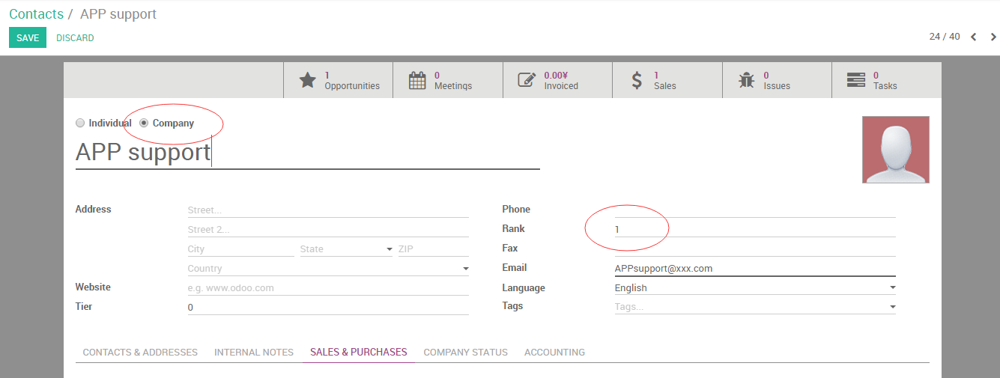
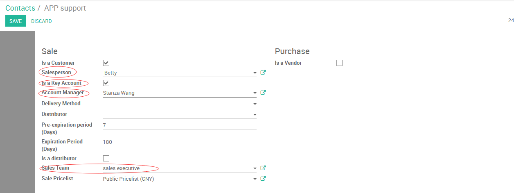

##########################################
Contact inherit parent company's attribute
##########################################

+----------------------------+----------------------------------------------------+-----------------+
| **Document #**             | **Title**                                          | **Date**        |
|                            |                                                    |                 |
|  FS0004ESP                 | Contact inherit parent company's attribute         | 2016/10/17      |
+----------------------------+----------------------------------------------------+-----------------+
| **Customer/Factory**       | **Project / Phase**                                | **Reference**   |
|                            |                                                    |                 |
|  Espressif                 |   Espressif / 4                                    | BR000626        |
+----------------------------+----------------------------------------------------+-----------------+

.. topic:: Overview

    This document is a **Functional Specification** for Odoo ERP implementation projects.

    * Maintainer: Shanghai Elico Limited (contact@elico-corp.com).
    * Distribution list: this documentation is **strictly confidential** and 
      should only be distributed for internal usage and restricted distribution 
      list.
    * Copyright: All rights reserved for Elico Corp since 2010 unless specified.
    * If you have come across that documentation by accident, please delete any 
      copy of it and do not distribute.
    
.. contents:: Table of contents
    :depth: 4
    

Customer Story
##############

Customer hope let contact inherit parent's company's attribute.
The fields and checkbox is 

    #. "sales person"
    #. "sales team"
    #. "rank"
    #. "key account manager"
    #. "is a key account" checkbox

Scenario
########

Currently, Odoo can separate different "sales person", "sales team",
"rank", "key account manager" for different contact even under same
parent company.

Gap
###

#. Need develop the rule for "sales person", "sales team",
   "rank", "key account manager" that fields in contact will inherit from
   parent Company's attribute for these fields.
#. Once company's attribute changed, the contact under this company will
   auto synchronize with these changes.
#. Once the module installed in server, the contact will auto synchronise
   with Company's attribute.
#. For the new created contact, will also inherit company's attribute as 
   default.
#. Only effective when the parent is Company.
#. Only effective when the contact is "is customer" checkbox checked for company
   and contact.

#. This is the images/description:

         "key account manager".

Revision History
****************
=========== =============== =============================================== ============
Rev.        Date            Description                                     Requested By
=========== =============== =============================================== ============
1.0         2016/10/17      Initial Release                                 Faust Huang
=========== =============== =============================================== ============

Contact
*******

If you have any question concerning this document, you can contact:

- `Shanghai Elico Limited <mailto:contact@elico-corp.com>`__
- `Eric Caudal (Project Sponsor) <mailto:eric.caudal@elico-corp.com>`__
- `Faust Huang (Project Manager) <mailto:faust.huang@elico-corp.com>`__
- `Noah Wang   (Technical Support) <mailto:noah.wang@elico-corp.com>`__