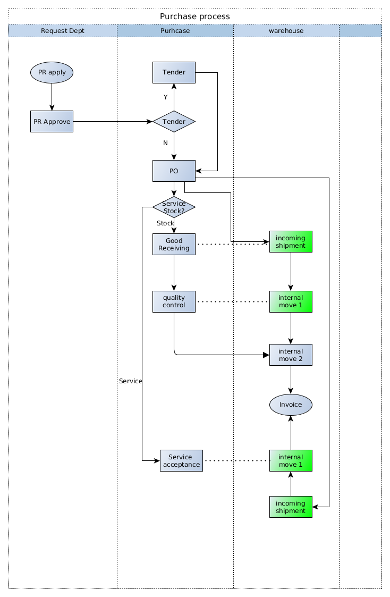

########################################
[Training Topic]
########################################

+----------------------------+----------------------------------------------------+-----------------+
| **Document #**             | **Title**                                          | **Date**        |
|                            |                                                    |                 |
| TR0000ELI                  | [Training Topic]                                   | [YYYY/MM/DD]    |
+----------------------------+----------------------------------------------------+-----------------+
| **Module/Version**         | **Project / Phase**                                | **Reference**   |
|                            |                                                    |                 |
| [Module/version]           | [Project name] / [1, 2, 3]                         | BR0001          |
+----------------------------+----------------------------------------------------+-----------------+

.. topic:: Overview

    This document is a **Training document** for Odoo ERP implementation projects.
    
    * Maintainer: Shanghai Elico Limited (contact@elico-corp.com).
    * Distribution list: this documentation is **strictly confidential** and 
      should only be distributed for internal usage and restricted distribution 
      list.
    * Copyright: All rights reserved for Elico Corp since 2010 unless specified.
    * If you have come across that documentation by accident, please delete any 
      copy of it and do not distribute.
    
.. contents:: Table of contents
    :depth: 4

Introduction
############
Reason of the training:

* Module
* uncovered official training
* SOP 
* Business Requirement

Setup
#####
Installation
************

Configuration
*************

Setup
*****

What version of Odoo or modules are use in this training document.

ACL
***

Which ACL are necessary in order to fulfill the training

Operations
##########
Process
*******

Below this tittle, explain the full process of the Module or Business Requirement used in this document.

Report
******

Limitation
**********

What exception to the Business requirement or Module are possible ?

Document information
####################
Glossary
********
[Terms in this document that users may not understand]

======= ==============================================
Term    Meaning
======= ==============================================
BoM     Bill of Material
CRM     Customer Relationship Management
etc.
======= ==============================================

Revision History
****************
=========== =============== =============================================== ===================
Rev.        Date            Description                                     Requested By
=========== =============== =============================================== ===================
1.0         2016/07/11      Initial Release                                 Eric Caudal
2.0         2016/09/03      Improved and harmonized all layouts             Eric Caudal
=========== =============== =============================================== ===================

Contact
*******

If you have any question concerning this document, you can contact:

- `Shanghai Elico Limited <mailto:contact@elico-corp.com>`__
- `Eric Caudal (Project Sponsor) <mailto:eric.caudal@elico-corp.com>`__
