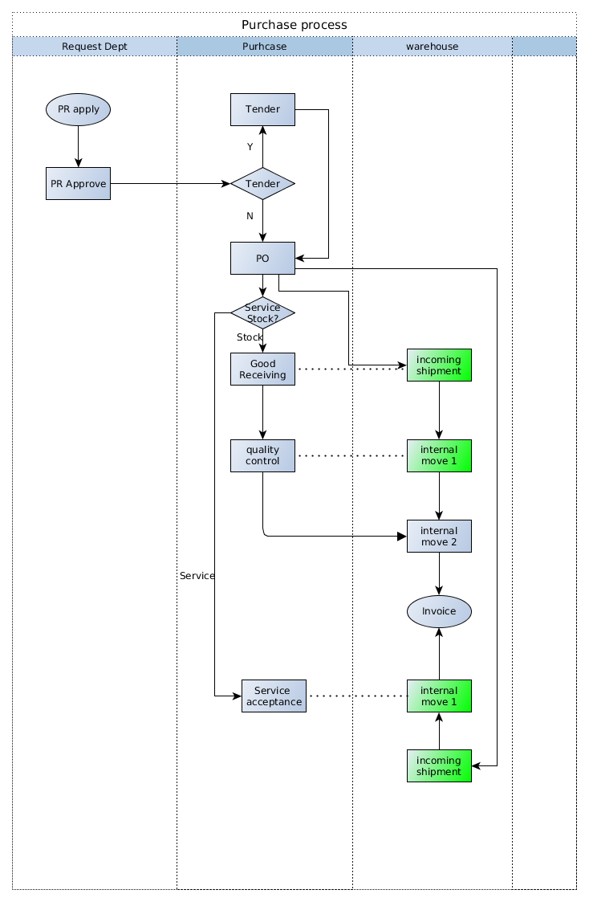

##############################################
[Technical Specification name]
##############################################

+----------------------------+----------------------------------------------------+-----------------+
| **Document #**             | **Title**                                          | **Date**        |
|                            |                                                    |                 |
| [TS0000ELI]                | [Technical Specification name]                     | [YYYY/MM/DD]    |
+----------------------------+----------------------------------------------------+-----------------+
| **Customer/Factory**       | **Project / Phase**                                | **Reference**   |
|                            |                                                    |                 |
| [Customer/Factory name]    | [Project name] / [1, 2, 3]                         | BR0001          |
+----------------------------+----------------------------------------------------+-----------------+

.. topic:: Overview

    This document is a **Technical Specification** document for Odoo ERP implementation projects.
    
    * Maintainer: Shanghai Elico Limited (contact@elico-corp.com).
    * Distribution list: this documentation is **strictly confidential** and 
      should only be distributed for internal usage and restricted distribution 
      list.
    * Copyright: All rights reserved for Elico Corp since 2010 unless specified.
    * If you have come across that documentation by accident, please delete any 
      copy of it and do not distribute.
    
.. contents:: Table of contents
    :depth: 4

Introduction
############

[Introduce what is the origin of the request (Business requirement) or
reason.]

This is an image:

License
*******

Name
****

Description
***********

Dependencies
************

[Odoo and External]

Module specifications
#####################

Data models
***********

Name of the data model:

* Field 1

   * Name in Odoo
   * Translations
   * Description
   * Comments
   * Specification

      * Type
      * Mandatory?
      * Invisible
      * Attributes
      * Domain
      * Default value
      * Relation and comodel
      * Help tip

* Field 2

   * Name in Odoo
   * etc...

Views
*****

[Main views to be created for the main objects

To be included: view type, location in menus]

Main Views (tree)
=================

Main Views (form)
=================

Main Views (search)
===================

Other Views (Kanban/Gantt/calendar/graph)
=========================================

Methods and workflows
*********************

Wizards
=======

[Wizard Filters, Wizard output, Location in menus]

Workflow
========

[Existing workflow involved

New Workflows to be created (Should include graph/design)]

Other treatment/scripts
=======================

Reports and Printouts
*********************

Printout
========

[Includes all reports to be done in qweb.

To be included: report type, location in menus]

BI reports
==========

Other (Export in Excel, webkit, aeroo, Pentaho)
===============================================

Miscellaneous
*************

ACL
===

[Groups, Users, Special users or rights, Security rules]

Automated tests
===============

[Unitests related information]

Data Migration scripts
======================

[Any script to be ran before or at module start up]

Document information
####################
Glossary
********
[Terms in this document that users may not understand]

======= ==============================================
Term    Meaning
======= ==============================================
BoM     Bill of Material
CRM     Customer Relationship Management
etc.
======= ==============================================

Revision History
****************
=========== =============== =============================================== ===================
Rev.        Date            Description                                     Requested By
=========== =============== =============================================== ===================
1.0         2015/10/09      Initial Release                                 Eric Caudal
2.0         2016/09/03      Improved and harmonized all layouts             Eric Caudal
=========== =============== =============================================== ===================

Contact
*******

If you have any question concerning this document, you can contact:

- `Shanghai Elico Limited <mailto:contact@elico-corp.com>`__
- `Eric Caudal (Project Sponsor) <mailto:eric.caudal@elico-corp.com>`__