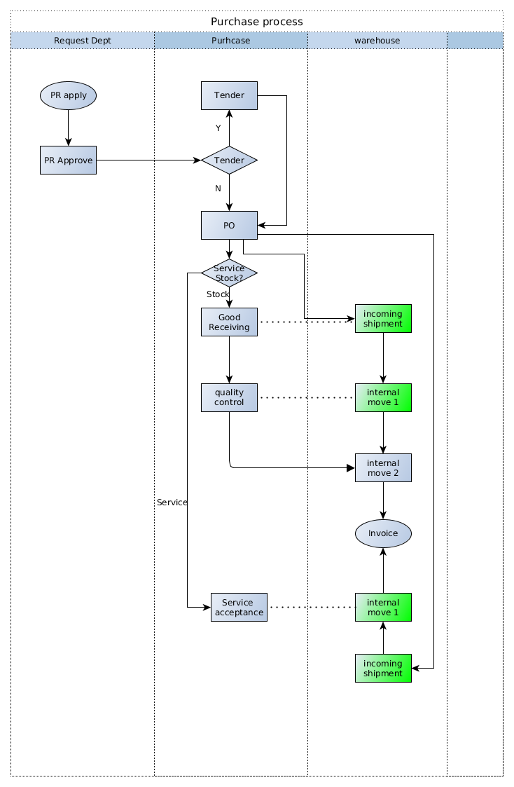

###############################
[Use case Name]
###############################

+----------------------------+----------------------------------------------------+-----------------+
| **Document #**             | **Title**                                          | **Date**        |
|                            |                                                    |                 |
| [UC0000ELI]                | [Use Case name]                                    | [YYYY/MM/DD]    |
+----------------------------+----------------------------------------------------+-----------------+
| **Customer/Factory**       | **Project / Phase**                                | **Reference**   |
|                            |                                                    |                 |
| [Customer/Factory name]    | [Project name] / [1, 2, 3]                         | BR0001          |
+----------------------------+----------------------------------------------------+-----------------+

.. topic:: Overview

    This document is a **Use Case** document for Odoo ERP implementation projects.
    
    * Maintainer: Shanghai Elico Limited (contact@elico-corp.com).
    * Distribution list: this documentation is **strictly confidential** and 
      should only be distributed for internal usage and restricted distribution 
      list.
    * Copyright: All rights reserved for Elico Corp since 2010 unless specified.
    * If you have come across that documentation by accident, please delete any 
      copy of it and do not distribute.
    
.. contents:: Table of contents
    :depth: 4

Introduction
############

[Introduce what is the origin of the Use case (Business requirement etc.) or
reason.]

This is an image/description/workflow:

Use case list
#############

#. Use Case 1: Environment and conditions description
#. Use Case 2: Environment and conditions description
#. Use Case 3: Environment and conditions description
#. Use Case 4: Environment and conditions description

Use case 1
##########

Expected input
**************

* User to input the data
* User to process/validate the data
* User to read the output
* Data/example to be used for the input (file/image etc.)

Processes/workflow
******************

#. Step 1
#. Step 2
#. Step 3
#. Step 4
#. Step 5

Expected output/result
**********************

* Reports
* Calculations
* screens
* Objects to be created

Limitations
***********

Document information
####################
Glossary
********
[Terms in this document that users may not understand]

======= ==============================================
Term    Meaning
======= ==============================================
BoM     Bill of Material
CRM     Customer Relationship Management
etc.
======= ==============================================

Revision History
****************
=========== =============== =============================================== ===================
Rev.        Date            Description                                     Requested By
=========== =============== =============================================== ===================
1.0         2016/07/11      Initial Release                                 Eric Caudal
2.0         2016/09/03      Improved and harmonized all layouts             Eric Caudal
=========== =============== =============================================== ===================

Contact
*******

If you have any question concerning this document, you can contact:

- `Shanghai Elico Limited <mailto:contact@elico-corp.com>`__
- `Eric Caudal (Project Sponsor) <mailto:eric.caudal@elico-corp.com>`__